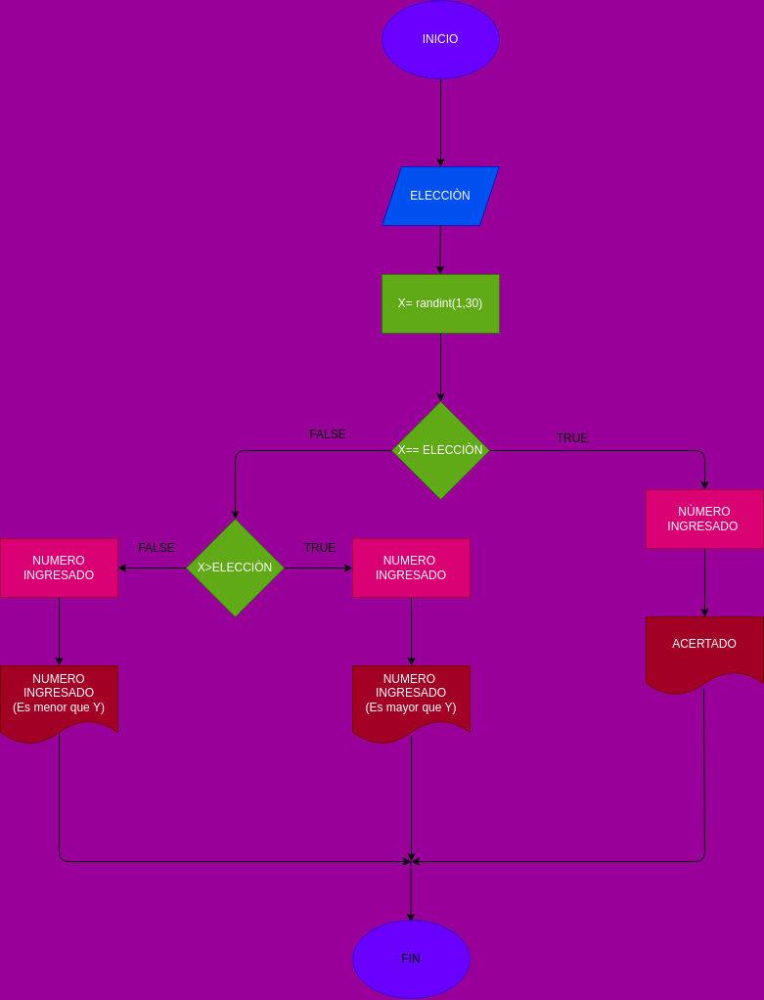

## adivina_el_numero

Juego de adivinar un numero de 1 10 

# ANALISIS

Variables de entrada

Numero_ingresado = ingrese un numero del 1 al 30

Varibles de proceso

numero_aleatorio = genera un numero aleatorio entre 1 y 30

Saber si el numero ingresado es igual al numero aleatorio o el numero ingresado es mayor al numero aleatorio o el numero ingresado es menor al numero aleatorio

Variablesn de salida

El numero ingresado es igual al numero aleatorio o el numero ingresado es mayor al numero aleatorio o el numero ingresado es menor al numero aleatorio

# DISEÑO

# CONSTRUCCION
